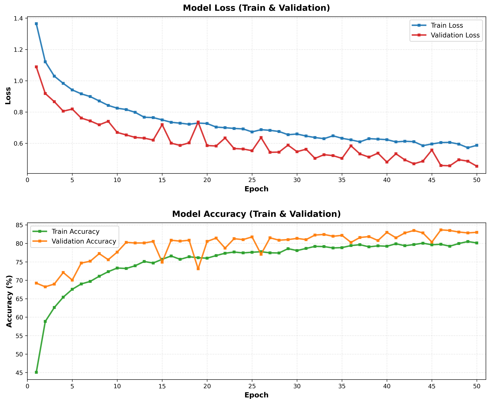
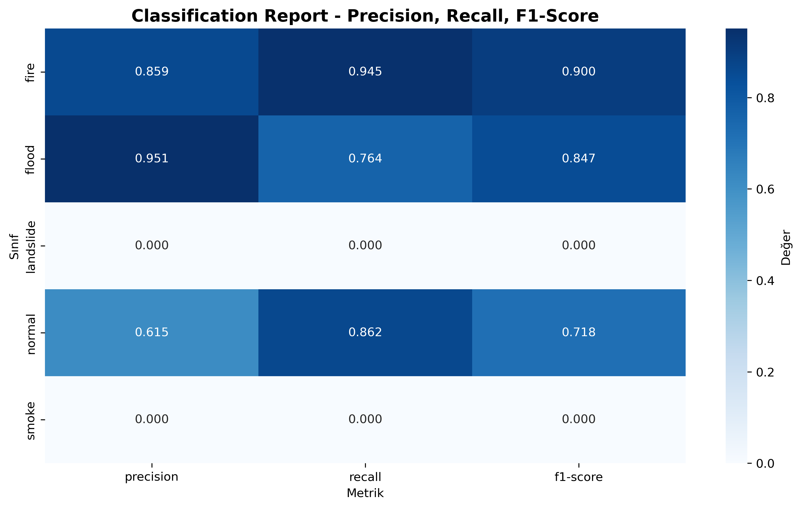

# 🌍 5 Sınıflı Afet Hasarı Görüntü Sınıflandırma - CNN Projesi

Bu proje, PyTorch kullanarak Conv2d tabanlı bir Convolutional Neural Network (CNN) modeli ile beş sınıflı afet hasarı görüntü sınıflandırma işlemi gerçekleştirmektedir.

## 📋 Proje Özeti

- **Veri Seti**: [Kaggle - Disaster Damage 5-Class Dataset](https://www.kaggle.com/datasets/sarthaktandulje/disaster-damage-5class) (kagglehub ile otomatik indirme)
- **Model**: PyTorch CNN (Conv2d tabanlı)
- **Sınıflar**: 5 sınıf afet hasarı kategorisi
- **Görüntü Boyutu**: 224x224 piksel
- **Framework**: PyTorch 2.0+

---

## 📊 Veri Seti Açıklaması

### Veri Seti Bilgileri

**Kaynak**: [Kaggle - Disaster Damage 5-Class Dataset](https://www.kaggle.com/datasets/sarthaktandulje/disaster-damage-5class)  
**Veri Seti Adı**: `sarthaktandulje/disaster-damage-5class`

### Sınıf Kategorileri

Bu veri seti, afet hasarını beş farklı kategoride sınıflandırmak için kullanılmaktadır:

1. **Fire** 🔥 - Yangın hasarı görüntüleri
2. **Flood** 💧 - Sel hasarı görüntüleri
3. **Landslide** 🏔️ - Toprak kayması hasarı görüntüleri
4. **Normal** ✅ - Hasarsız/normal görüntüler
5. **Smoke** 💨 - Duman görüntüleri

### Veri Seti Özellikleri

- **Otomatik İndirme**: Kagglehub kütüphanesi ile otomatik indirme
- **Yapı Tespiti**: Dataset yapısı otomatik olarak tespit edilir (Training/Testing veya direkt sınıf klasörleri)
- **Sınıf Tespiti**: Sınıf isimleri otomatik olarak belirlenir
- **Veri Split**: 
  - Ayrı test klasörü varsa: Train/Val (80/20) + Test (ayrı)
  - Test klasörü yoksa: Train/Val/Test (70/15/15)
- **Truncated Image Desteği**: Bozuk görüntüler otomatik olarak handle edilir

### Veri Hazırlama

- **Training Transform**: Güçlendirilmiş data augmentation (RandomRotation, RandomAffine, RandomHorizontalFlip, ColorJitter)
- **Validation/Test Transform**: Sadece resize ve normalize
- **Otomatik Hiperparametre Ayarlama**: Dataset boyutuna göre batch size ve epoch sayısı otomatik ayarlanır

---

## 🏗️ Model Mimarisi

### CNN Yapısı Detayları

Model, 3 Convolutional Blok, Global Average Pooling ve Fully Connected katmanlardan oluşmaktadır:

#### 1. Convolutional Bloklar

```
Conv Block 1:
  ├─ Conv2d(3 → 64, kernel=3x3, padding=1)
  ├─ BatchNorm2d(64)
  ├─ ReLU Activation
  └─ MaxPool2d(2x2, stride=2)

Conv Block 2:
  ├─ Conv2d(64 → 128, kernel=3x3, padding=1)
  ├─ BatchNorm2d(128)
  ├─ ReLU Activation
  └─ MaxPool2d(2x2, stride=2)

Conv Block 3:
  ├─ Conv2d(128 → 256, kernel=3x3, padding=1)
  ├─ BatchNorm2d(256)
  ├─ ReLU Activation
  └─ MaxPool2d(2x2, stride=2)
```

#### 2. Global Average Pooling

```
AdaptiveAvgPool2d((1, 1)) → 256 özellik vektörü
```

#### 3. Fully Connected Katmanlar

```
FC Layer 1:
  ├─ Linear(256 → 128)
  ├─ ReLU Activation
  └─ Dropout(0.6)

FC Layer 2:
  ├─ Linear(128 → 64)
  ├─ ReLU Activation
  └─ Dropout(0.6)

FC Layer 3 (Output):
  └─ Linear(64 → 5) → Sınıf logits
```

### Model Özellikleri

- ✅ **Toplam Parametre**: ~250K-500K (model boyutuna göre)
- ✅ **Batch Normalization**: Her convolutional blokta normalize etme
- ✅ **Dropout Regularization**: FC katmanlarda 0.6 dropout oranı
- ✅ **Global Average Pooling**: Overfitting'i azaltmak için
- ✅ **Optimizer**: Adam (lr=1e-4, weight_decay=1e-4)
- ✅ **Loss Function**: CrossEntropyLoss
- ✅ **Scheduler**: ReduceLROnPlateau (patience=7, factor=0.5)
- ✅ **Early Stopping**: Patience=10 epoch ile overfitting önleme

### Model Mimarisi Görselleştirmesi

Model özeti `model_summary.txt` dosyasında detaylı olarak bulunabilir.

---

## 📈 Eğitim Grafikleri ve Başarı Metrikleri

### Eğitim Geçmişi

Model eğitimi sırasında kaydedilen loss ve accuracy değerleri aşağıdaki grafiklerde görselleştirilmiştir:



**Grafik Açıklaması**:
- **Üst Grafik**: Model Loss (Train & Validation) - Loss değerlerinin epoch'lara göre değişimi
- **Alt Grafik**: Model Accuracy (Train & Validation) - Doğruluk değerlerinin epoch'lara göre değişimi

**Beklenen Davranış**:
- Validation loss, train loss'tan düşük olmalı (veya yakın)
- Validation accuracy, train accuracy'den yüksek olmalı (veya yakın)
- Eğriler dengeli bir şekilde ilerlemeli (overfitting/underfitting yok)

### Confusion Matrix

Test seti üzerinde model performansının detaylı analizi:


**Confusion Matrix Açıklaması**:
- Her sınıf için doğru ve yanlış tahminlerin dağılımı
- Çapraz değerler doğru tahminleri gösterir
- Yanlış tahminler hangi sınıflara karıştığını gösterir

### Classification Report

Sınıf bazlı detaylı performans metrikleri:



**Metrikler**:
- **Precision**: Her sınıf için pozitif tahminlerin doğruluk oranı
- **Recall**: Her sınıf için gerçek pozitiflerin yakalanma oranı
- **F1-Score**: Precision ve Recall'un harmonik ortalaması

Detaylı metrikler `classification_report.txt` dosyasında bulunabilir.

### Tahmin Görselleştirmeleri

#### Doğru Tahminler


Model tarafından doğru tahmin edilen örnek görüntüler. Her görüntüde gerçek sınıf ve tahmin edilen sınıf gösterilir.

#### Yanlış Tahminler


Model tarafından yanlış tahmin edilen örnek görüntüler. Modelin hangi durumlarda hata yaptığını analiz etmek için kullanılabilir.

---

## 🎯 Hedefler ve Başarı Kriterleri

- ✅ **Yüksek Accuracy**: Mümkün olduğunca yüksek doğruluk oranı hedeflenir
- ✅ **Düşük Loss**: Mümkün olduğunca düşük kayıp değeri hedeflenir
- ✅ **Dengeli Eğitim**: Train ve validation eğrilerinin birlikte ve dengeli ilerlemesi
- ✅ **Overfitting Önleme**: Early stopping ve dropout ile overfitting önlenir
- ✅ **Sınıf Dengesi**: Her sınıf için dengeli performans hedeflenir

---

## 🚀 Kurulum

### 1. Conda Environment Oluşturma

```bash
# Conda environment oluştur
conda env create -f environment.yml

# Environment'ı aktifleştir
conda activate disaster-damage-cnn
```

### 2. Requirements ile Kurulum (Alternatif)

```bash
pip install -r requirements.txt
```

### 3. Jupyter Kernel Kurulumu

```bash
python -m ipykernel install --user --name disaster-damage-cnn --display-name "Python (disaster-damage-cnn)"
```

---

## 📖 Kullanım

### Jupyter Notebook ile Çalıştırma

1. Jupyter Notebook'u başlatın:
```bash
jupyter notebook
```

2. `Disaster_Damage_CNN.ipynb` dosyasını açın

3. Tüm hücreleri sırayla çalıştırın (Kernel → Restart & Run All)

### Veri Seti

Veri seti otomatik olarak Kaggle'dan indirilir. İlk çalıştırmada `kagglehub` kütüphanesi veri setini otomatik olarak indirecektir.

---

## 📊 Çıktılar

Eğitim tamamlandığında aşağıdaki dosyalar oluşturulur:

### Model Dosyaları
- `best_model.pth` - En iyi model checkpoint
- `model_summary.txt` - Model mimarisi özeti

### Görselleştirme Dosyaları
- `training_history.png` - Eğitim geçmişi grafikleri (Loss & Accuracy - 2 grafik üst üste)
- `confusion_matrix.png` - Confusion matrix
- `classification_report_table.png` - Sınıflandırma raporu tablosu (heatmap)
- `correct_predictions.png` - Doğru tahmin edilen örnekler (en fazla 16 görüntü)
- `incorrect_predictions.png` - Yanlış tahmin edilen örnekler (en fazla 16 görüntü)

### Rapor Dosyaları
- `classification_report.txt` - Detaylı sınıflandırma raporu (text format)

---

## 🔧 Teknik Detaylar

### Hiperparametreler

| Parametre | Değer | Açıklama |
|-----------|-------|----------|
| **Batch Size** | 16/32/64 | Dataset boyutuna göre otomatik ayarlanır |
| **Learning Rate** | 1e-4 | Sabit başlangıç değeri |
| **Epochs** | 30/50 | Dataset boyutuna göre otomatik ayarlanır (maksimum 50) |
| **Image Size** | 224x224 | Giriş görüntü boyutu |
| **Dropout Rate** | 0.6 | FC katmanlarda düzenlileştirme |
| **Weight Decay** | 1e-4 | L2 regularization |

### Data Augmentation (Eğitim)

Eğitim sırasında uygulanan transformlar:
- **Resize**: (274x274) → RandomCrop (224x224)
- **Random Rotation**: ±35° rastgele döndürme
- **Random Affine**: Translation (0.15), Scale (0.85-1.15)
- **Random Horizontal Flip**: p=0.5 olasılıkla yatay çevirme
- **ColorJitter**: 
  - Brightness: 0.2
  - Contrast: 0.2
  - Saturation: 0.2
  - Hue: 0.1

### Validation Transform

Validasyon ve test için:
- **Resize**: (224x224)
- **Normalize**: ImageNet mean/std değerleri ile normalize

### Eğitim Stratejisi

1. **Veri Yükleme**: Kaggle'dan otomatik indirme
2. **Veri Hazırlama**: Otomatik train/val/test split
3. **Model Eğitimi**: 
   - Early stopping ile overfitting önleme
   - Learning rate scheduling ile optimizasyon
   - En iyi model otomatik kaydetme
4. **Değerlendirme**: Test seti üzerinde kapsamlı metrikler
5. **Görselleştirme**: Detaylı grafikler ve raporlar

---

## 📈 Eğitim Süreci

1. **Veri Yükleme**: Kaggle'dan otomatik indirme
2. **Veri Hazırlama**: 
   - Dataset sınıfı oluşturma
   - Transform tanımlama
   - Train/Val/Test split
3. **Model Eğitimi**: 
   - Early stopping
   - Learning rate scheduling
   - Progress tracking
4. **Değerlendirme**: 
   - Test seti üzerinde metrikler
   - Confusion matrix
   - Classification report
5. **Görselleştirme**: 
   - Eğitim grafikleri
   - Tahmin örnekleri
   - Performans metrikleri

---

## 🛠️ Gereksinimler

- **Python**: 3.9+
- **PyTorch**: 2.0+
- **CUDA**: 11.8+ (GPU için, opsiyonel)
- **RAM**: 8GB+ önerilir
- **Disk**: Veri seti ve model için yeterli alan

### Gerekli Kütüphaneler

- PyTorch & Torchvision
- NumPy & Pandas
- Matplotlib & Seaborn
- Scikit-learn
- Pillow (PIL)
- Kagglehub
- tqdm
- Jupyter & IPykernel

---

## 📝 Lisans

Bu proje eğitim amaçlıdır.

---

## 👤 Yazar

AHMET ŞİMŞEK

---

## 🔗 Kaynaklar

- [PyTorch Documentation](https://pytorch.org/docs/stable/index.html)
- [Kaggle Dataset](https://www.kaggle.com/datasets/sarthaktandulje/disaster-damage-5class)
- [Kagglehub Documentation](https://github.com/Kaggle/kagglehub)

---

**Not**: İlk çalıştırmada veri seti indirileceği için internet bağlantısı gereklidir.
